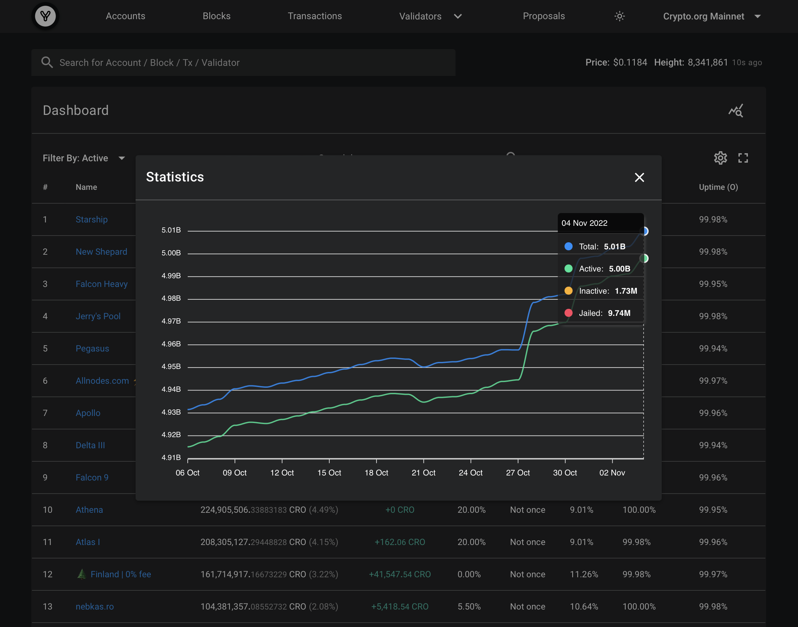

# Crypto.com: MultiSig 7

## Intro

With the release of [next-explorer](https://next-explorer.yummy.capital) we now have the ability to view top accounts on Crypto.org Mainnet. Looking through the first pages, you will see several tens of accounts that have an impressive number of CRO and only two transactions: `send` and `delegate`. And on top of that they all delegated their funds to a particular set of validators: to CDC validators and to some community validators. Doesn't it seem suspicious? Let's look into it.

## 21 February 2021


It is the day before the announcement of [«70 billion CRO to be burned»](https://blog.crypto.com/70-billion-cro-to-be-burned/). A large amount of CRO were [withdrawn](./data/1-withdrawals.json) from `Crypto.com MultiSig 7` to various addresses that were never used. According to our data, funds were withdrawn to `796` addresses, and a total of `5.682 billion` CRO were withdrawn.

> Later, some of these funds will be migrated to Crypto.org Mainnet.

## Preparations for migration

Since the funds were withdrawn to addresses that had never been used, they had to be topped up with ether in order to move the funds further.

> Funds from 323 of 796 addresses were migrated to Crypto.org Mainnet.

> Only two addresses were topped up directly from Binance.

> The remaining addresses were topped up from 13 midterms addresses.

Excluding the two addresses (`0xcc194f54ceae7747a2b26db578ef9129387b2535` and `0x1f7a2de90be5c458adbae7bf725572dff55df20a`) that were topped up directly from Binance, we have the following:

```
01) Binance => 0x1c1cc5388d7ed814d0cf8a07ba7d2e45026f1ac4 => 46 addresses
02) Binance => 0xbd99d28fb447332d1c5374c6e3bf640a723328d7 => 41 addresses
03) Binance => 0x8657373b3fc2a5e36999fb5dcf9c64f5618ff89a => 21 addresses
04) Binance => 0xf357e9cac01d72d3774f8f462e241361c3ebeee4 => 20 addresses
05) Binance => 0x6920a2549da1bf113b3335a122a1477ecdffc890 => 20 addresses
06) Binance => 0xcacd298f1f9a89c5a60d56cb14668c4457069c02 => 24 addresses
07) Binance => 0xb2603e7a56673fdb7d13f718401b5ce54b415eef => 23 addresses
08) Binance => 0x06a034b6aea34b431f601a8cbdf6c159da01fc91 => 22 addresses
09) Binance => 0x6031aa66b1ab09f6d25274cac96d63bb941dbe75 => 9 addresses
10) Binance => 0x546f6aeb79b5ac110599fbba3cfe3cbb4e073c9f => 25 addresses
11) Binance => 0x01e6f3e73b5f038f5d2dafabcafb29a3649fdfde => 68 addresses
12) Binance => 0xf7fd72bbf7f83f371c802229458c3247ed0c5823 => 40 addresses
13) Binance => 0x32a33c70e47d2e8fbed0585783e696503a0b2314 => 38 addresses
```

In addition, midterm address #2 was used to top up addresses that were topped up by midterm address #3. There is a similar situation with addresses #4 and #5.

[Here](./data/2-1-intersections-2-and-3.json) are the addresses that were topped up from addresses #2 and #3, and [here](./data/2-2-intersections-4-and-5.json) are the addresses that were topped up from addresses #5 and #6.

All top-ups were done both directly and via the [Multisender.app](https://etherscan.io/address/0xa5025faba6e70b84f74e9b1113e5f7f4e7f4859f) contract. [Here](./data/2-3-multisender-txs.json) are the transactions that Multisender.app used. And all grouped data available [here](./data/2-4-preparations.json).

Based on the `height` field in each group, it can be concluded that these transactions have been **automated**.

## Migrations

Based on the amount of CRO that have migrated from Ethereum network to Crypto.org Mainnet, were able to identify these transactions and determine the final addresses for each migration transaction. This [dataset](./data/3-migrations.json) contains migrations records: CRO burn transactions on Ethereum network and their subsequent appearance on Crypto.org Mainnet.

## Delegations

Finally, the migrated funds were delegated to the validators.

There are two datasets with delegation transactions. [The first](./data/4-1-delegations.json) was sorted by height in ascending order, and [the second](<(./data/4-2-delegations.json)>) was grouped by address, which were used to top up with ether.

Using this data, you can [see](./data/4-3-delegations.log) how the delegations happened: first one group of addresses was used, then the next, and so on.

| #   | Group                                      | Start Height | End Height |
| --- | ------------------------------------------ | ------------ | ---------- |
| 01  | 0x6031aa66b1ab09f6d25274cac96d63bb941dbe75 | 5,142        | 17,569     |
| 02  | 0x546f6aeb79b5ac110599fbba3cfe3cbb4e073c9f | 6,278        | 119,264    |
| 03  | 0x06a034b6aea34b431f601a8cbdf6c159da01fc91 | 119,273      | 179,212    |
| 04  | 0xb2603e7a56673fdb7d13f718401b5ce54b415eef | 179,229      | 192,139    |
| 05  | 0xcacd298f1f9a89c5a60d56cb14668c4457069c02 | 203,530      | 242,203    |
| 06  | 0x6920a2549da1bf113b3335a122a1477ecdffc890 | 242,213      | 243,188    |
| 07  | 0xbd99d28fb447332d1c5374c6e3bf640a723328d7 | 258,632      | 259,114    |
| 08  | 0x8657373b3fc2a5e36999fb5dcf9c64f5618ff89a | 265,439      | 269,081    |
| 09  | 0x32a33c70e47d2e8fbed0585783e696503a0b2314 | 265,616      | 292,229    |
| 10  | 0x1c1cc5388d7ed814d0cf8a07ba7d2e45026f1ac4 | 295,109      | 550,702    |
| 11  | 0xf7fd72bbf7f83f371c802229458c3247ed0c5823 | 335,866      | 550,226    |
| 12  | 0x01e6f3e73b5f038f5d2dafabcafb29a3649fdfde | 363,231      | 550,423    |

In the last 5 groups there is a significant difference between the start and end heights. There are several subgroups.

| #   | Group                                      | SH (1)  | EH (1)  | SH (2)  | EH (2)  | SH (3)  | EH (3)  |
| --- | ------------------------------------------ | ------- | ------- | ------- | ------- | ------- | ------- |
| 08  | 0x8657373b3fc2a5e36999fb5dcf9c64f5618ff89a | 265,439 | 265,593 | 269,002 | 269,081 | –       | –       |
| 09  | 0x32a33c70e47d2e8fbed0585783e696503a0b2314 | 265,616 | 265,823 | 283,181 | 284,206 | 292,187 | 292,229 |
| 10  | 0x1c1cc5388d7ed814d0cf8a07ba7d2e45026f1ac4 | 295,109 | 297,486 | 360,351 | 360,406 | 550,570 | 550,702 |
| 11  | 0xf7fd72bbf7f83f371c802229458c3247ed0c5823 | 335,866 | 336,138 | 359,682 | 359,784 | 550,088 | 550,226 |
| 12  | 0x01e6f3e73b5f038f5d2dafabcafb29a3649fdfde | 363,231 | 364,046 | 459,195 | 459,382 | 550,241 | 550,423 |

This may be due to an incorrect initial grouping. But, nevertheless, there are neighborhoods in which delegations occur. Delegations arise from group to group and hardly intersect with each other.

For example, here is what the delegations for groups #7 and #8 look like:


The whole thing is very much like to iterating over a list of validators:

```
1: Making.cash
2: nebkas.ro
3: Smart Stake - cc.smartstake.io
4: Crypto.bzh
5: Forbole
6: cros-nest
7: Allnodes ⚡️ 0% fee
```

## Conclusion

A large amount of CRO were withdrawn from `Crypto.com: MultiSig 7` wallet and subsequently migrating to Crypto.org Mainnet. Then being delegated to the CDC validators and some community validators. It's very likely that all this was done by an automated process and controlled by a single owner.

| #   | Validator                      | Delegated (CRO)        | Total Delegated (CRO)\* | Percentage\*\* |
| :-- | :----------------------------- | ---------------------- | ----------------------- | -------------- |
| 1   | Falcon Heavy                   | 317,657,249.5514       | 354,413,447.2283        | 89.63%         |
| 2   | Starship                       | 283,658,312.2731       | 318,706,187.6512        | 89.00%         |
| 3   | Apollo                         | 260,694,840.9104       | 270,827,894.3901        | 96.26%         |
| 4   | Delta III                      | 245,874,342.8227       | 257,925,518.5769        | 95.33%         |
| 5   | New Shepard                    | 210,935,163.1804       | 264,880,389.7674        | 79.63%         |
| 6   | Athena                         | 188,391,533.9349       | 227,024,454.2117        | 82.98%         |
| 7   | Atlas I                        | 168,905,643.684        | 210,085,731.7455        | 80.40%         |
| 8   | Pegasus                        | 126,040,996.8725       | 163,532,437.5523        | 77.07%         |
| 9   | Falcon 9                       | 103,635,702.0445       | 118,710,260.9617        | 87.30%         |
| 10  | Making.cash                    | 94,290,359.4574        | 95,234,063.6578         | 99.01%         |
| 11  | nebkas.ro                      | 84,188,386.1966        | 103,593,552.8665        | 81.27%         |
| 12  | Smart Stake - cc.smartstake.io | 77,311,672.4473        | 102,593,196.7832        | 75.36%         |
| 13  | Forbole                        | 73,059,945.3649        | 73,304,348.6669         | 99.67%         |
| 14  | cros-nest                      | 70,462,058.3899        | 74,722,094.6717         | 94.30%         |
| 15  | Crypto.bzh                     | 69,647,680.3472        | 73,890,930.5312         | 94.26%         |
| 16  | Allnodes                       | 52,350,504.227         | 223,421,460.523         | 23.43%         |
| 17  | BCW CC Node                    | 10,000,000.00          | 10,004,606.1166         | 99.95%         |
| 18  | [SG] X Staking                 | 8,150,563.7169         | 15,755,786.5985         | 51.73%         |
| 19  | Cosmostation                   | 5,000,000.00           | 6,037,420.9304          | 82.82%         |
| 20  | Bison Trails                   | 5,000,000.00           | 5,440,679.1390          | 91.90%         |
| 21  | Stakin                         | 1,000,000.00           | 7,515,240.3577          | 13.31%         |
| 22  | Defier                         | 800,000.00             | 2,814,325.4242          | 28.43%         |
|     | **Total**                      | **2,457,054,955.4211** |                         |                |

**\*** Valid as of 12/11/2021.  
**\*\*** The ratio between the delegated amount from `Crypto.com: MultiSig 7` and the total delegated amount.

#### Updated: 01.08.22

Astrologers proclaim the week of migrations.
Bonded tokens amount increased.



A few more wallets were involved and transferred funds from Ethereum to Crypto.org Mainnet:
* Migrated an additional ~217 million CRO.
* Of these, ~146 million have already been delegated.
* And the remaining ~71 million have not yet been used.

You can see related data [here](./data/5-fresh-transfers.json).
